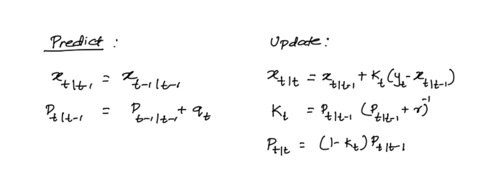
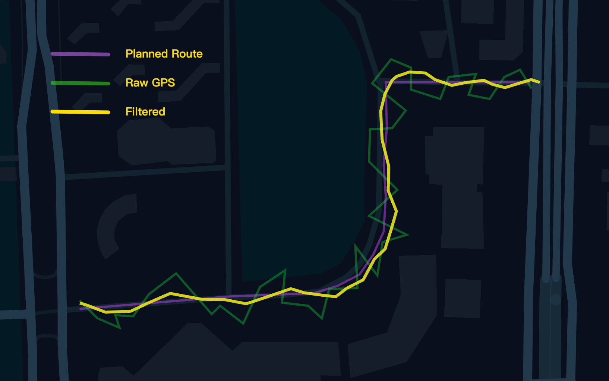

# Kalman Filtering



Implement `Kalman Filtering` in Golang using for GPS positioning or trajectory processing.

## Usage

* See example [here](/example/main.go).
* CLI: 
    ```shell
    cd example
    go build -o kalman main.go

    # Args:
    # -r route.geojson    : predicted route (from route planning system)
    # -g gps.geojson      : measured route (from GPS)
    # -o estimated.geojson: estimated route (from kalman filter)
    ./kalman -r route.geojson -g gps.geojson -o estimated.geojson
    ```
* Result

    
 